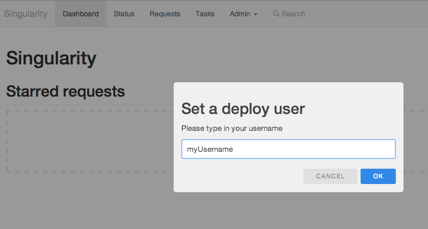

## Install Singularity with Vagrant
Follow the instructions to create a virtual machine that runs Singularity on top of a Mesos cluster. All Mesos components (Mesos master and slave), all Singularity components (Singularity master, Singularity Executor, Singularity UI, S3Archiver, etc.) as well as their dependencies (Zookeper, MySQL) will run in the same virtual machine.

This setup is only meant for testing purposes; to give you the possibility to quickly take a look and experiment with the available tools, UIs and APIs.

The setup steps have been tested on mac computers running MAC OS X 10.9.x but they should as well work on any recent Linux distribution.

Install [Vagrant](http://www.vagrantup.com/downloads.html)

Install [Virtualbox](https://www.virtualbox.org/wiki/Downloads)

Open a command shell and run the following commands to install the required vagrant plugins with the specified order (If vagrant version 1.5 or later is used *vagrant-omnibus* should be installed before *vagrant-berkshelf* because omnibus causes a downgrade of berkshelf version back to 1.3.7 which in turn will cause 'vagrant up' to fail).

```
$ vagrant plugin install vagrant-omnibus
$ vagrant plugin install vagrant-berkshelf --plugin-version=2.0.1
$ vagrant plugin install vagrant-hostsupdater
```

Clone Singularity from *github.com* in you preferred directory and go into the *vagrant* directory inside the cloned project:

```
$ cd my_home/tests
$ git clone git@github.com:HubSpot/Singularity.git
$ cd Singularity/vagrant
$ ls
```

Look for the provided *Vagrantfile* that contains the required vagrant commands for setting up a *VirtualBox* VM with all required software. To start building the VM run the following command: 

```
$ vagrant up
```

This command will first setup and then bring up the virtual machine. The first time you run this, you should be patient because it needs to download a basic Linux image and then install all the required software packages as well as build and install Singularity. When this is done the first time, every other time that you run *vagrant up*, it will take only a few seconds to boot the virtual machine up.

When vagrant command finishes check that everything has been installed successfully executing the following steps:

First verify that Zookeeper is running by logging into the virtual machine and using the zookeeper command line tool to connect to the zookeeper server and list the available nodes:
```
$ vagrant ssh
$ sudo /usr/share/zookeeper/bin/zkCli.sh -server localhost:2181

When connected execute the following command to list the root nodes:
ls /

You should see the following listing:
[singularity, mesos, zookeeper]

type 'quit' to exit zookeper console
```
 
Then verify that the mesos cluster is running and the Mesos UI is accessible at:

[http://vagrant-singularity:5050/](http://vagrant-singularity:5050/)

Verify that mysql server is running: 

```
$ mysql -u root -p

specify *mesos7mysql* as password

then check if singularity database has been created:

mysql> show databases;

You should something like the following:
+--------------------+
| Database           |
+--------------------+
| information_schema |
| mysql              |
| performance_schema |
| singularity        |
+--------------------+

type 'exit' to exit mysql client console
```

Verify that Singularity is running:

[http://vagrant-singularity:7099/](http://vagrant-singularity:7099/)

If everything went well you will see the following screen:


Enter your username to let Singularity populate a personalized dashboard and go to [Singularity UI User Guide](Docs/Singularity_UI_User_Guide) to find out how to deploy some test projects.
