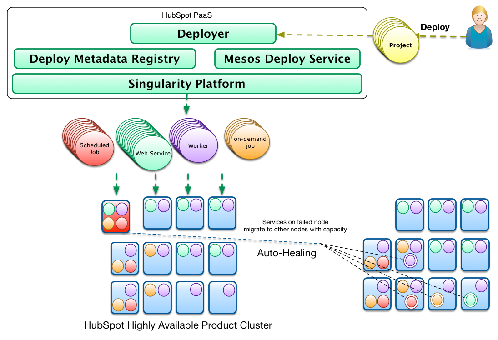
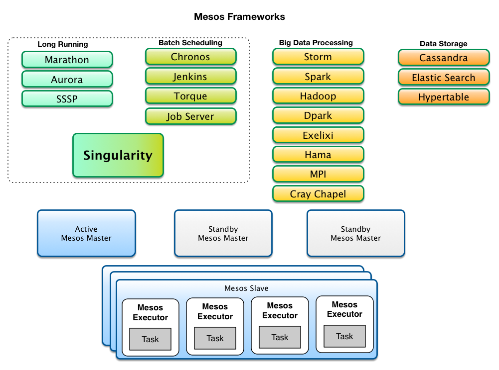
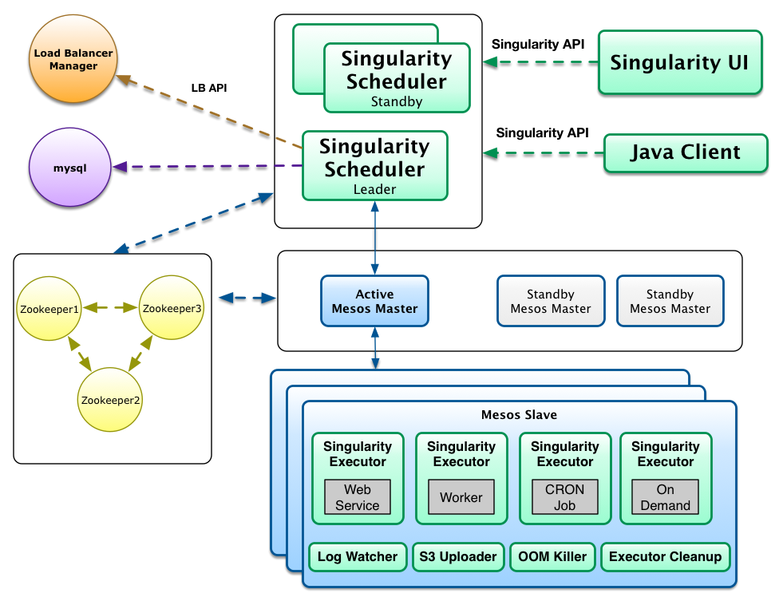
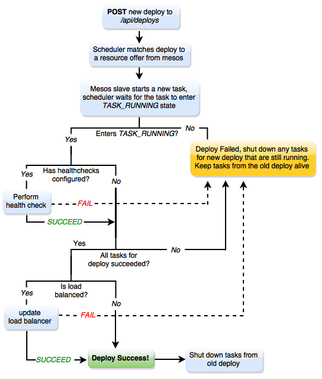

## What is Singularity
**Singularity** is a platform that enables deploying and running services and scheduled jobs in the cloud or data centers. Combined with Apache Mesos, it provides efficient management of the underlying processes life cycle and effective use of cluster resources.

Singularity is an essential part of the HubSpot Platform and is ideal for deploying micro-services. It is optimized to manage thousands of concurrently running processes in hundreds of servers.

## How it Works
Singularity is an [**Apache Mesos framework**](http://mesos.apache.org/documentation/latest/mesos-frameworks/). It runs as a *task scheduler* on top of **Mesos Clusters** taking advantage of Apache Mesos' scalability, fault-tolerance, and resource isolation. [Apache Mesos](http://mesos.apache.org/documentation/latest/mesos-architecture/) is a cluster manager that simplifies the complexity of running different types of applications on a shared pool of servers. In Mesos terminology, *Mesos applications* that use the Mesos APIs to schedule tasks in a cluster are called [*frameworks*](http://mesos.apache.org/documentation/latest/app-framework-development-guide/).

There are different types of frameworks and most frameworks concentrate on a specific type of task (e.g. long-running vs scheduled cron-type jobs) or supporting a specific domain and relevant technology (e.g. data processing with hadoop jobs vs data processing with spark). 

Singularity tries to be more generic by combining **long-running tasks** and **job scheduling** functionality in one framework to support many of the common process types that developers need to deploy every day to build modern web applications and services. While Mesos allows multiple frameworks to run in parallel, it greatly simplifies the PaaS architecture by having a consistent and uniform set of abstractions and APIs for handling deployments across the organization. Additionally, it reduces the amount of framework boilerplate that must be supported - as all Mesos frameworks must keep state, handle failures, and properly interact with the Mesos APIs. These are the main reasons HubSpot engineers initiated the development of a new framework. As of this moment, Singularity supports the following process types:

- **Web Services**. These are long running processes which expose an API and may run with multiple load balanced instances. Singularity supports automatic configurable health checking of the instances at the process and API endpoint level as well as load balancing. Singularity will automatically restart these tasks when they fail or exit. 
- **Workers**. These are long running processes, similar to web services, but do not expose an API. *Queue consumers* are a common type of worker processes. Singularity does automatic health checking, cool-down and restart of worker instances.
- **Scheduled (CRON-type) Jobs**. These are tasks that periodically run according to a provided CRON schedule. Scheduled jobs will not be restarted when they fail unless instructed to do so. Singularity will run them again on the next scheduling cycle.
- **On-Demand Processes**. These are manually run processes that will be deployed and ready to run but Singularity will not automatically run them. Users can start them through an API call or using the Singularity Web UI, which allows them to pass command line parameters on-demand.

## Singularity Components
Mesos frameworks have two major components. A **scheduler component** that registers with the **Mesos master** to be offered resources and an **executor component** that is launched on cluster slave nodes by the **Mesos slave process** to run the framework tasks. 

The *Mesos master* determines how many resources are offered to each framework and the *framework scheduler* selects which of the offered resources to use to run the required tasks. Mesos slaves do not directly run the tasks but delegate the running to the appropriate *executor* that has knowledge about the nature of the allocated task and the special handling that might be required.

As depicted in the figure, Singularity implements the two basic framework components as well as a few more to solve common complex / tedious problems such as task cleanup and log tailing / archiving without requiring developers to implement it for each task they want to run:

### Singularity Scheduler
The scheduler is the core of Singularity: a [DropWizard](http://www.dropwizard.io/) API that implements the Mesos Scheduler Driver. The scheduler matches client deploy requests to Mesos resource offers and acts as a web service offering a JSON REST API for accepting deploy requests.

Clients use the Singularity API to register the type of deployable item that they want to run (web service, worker, cron job) and the corresponding runtime settings (cron schedule, # of instances, whether instances are load balanced, rack awareness, etc.). 

After a deployable item (a **request**, in API terms) has been registered, clients can post *Deploy requests* for that item. Deploy requests contain information about the command to run, the executor to use, executor specific data, required cpu, memory and port resources, health check URLs and a variety of other runtime configuration options. The Singularity scheduler will then attempt to match Mesos offers (which in turn include resources as well as rack information and what else is running on slave hosts) with its list of *Deploy requests* that have yet to be fulfilled.

<a name="deploys"/>

Rollback of failed deploys, health checking and load balancing are also part of the advanced functionality the Singularity Scheduler offers. A new deploy for a long runing service will run as shown in the diagram below.

When a service or worker instance fails in a new deploy, the Singularity scheduler will rollback all instances to the version running before the deploy, keeping the deploys always consistent. After the scheduler makes sure that a Mesos task (corresponding to a service instance) has entered the TASK_RUNNING state it will use the provided health check URL and the specified health check timeout settings to perform health checks. If health checks go well, the next step is to perform load balancing of service instances. Load balancing is attempted only if the corresponding deployable item has been defined to be *loadBalanced*. To perform load balancing between service instances, Singularity supports a rich integration with a specific Load Balancer API. Singularity will post requests to the Load Balancer API to add the newly deployed service instances and to remove those that were previously running. Check [Integration with Load Balancers](../development/load-balancer-integration.md) to learn more. Singularity also provides generic webhooks which allow third party integrations, which can be registered to follow request, deploy, or task updates.

<a name="placement"/>

#### Slave Placement

When matching a Mesos resource offer to a deploy, Singularity can use one of several strategies to determine if the host in the offer is appropriate for the task in question, or `SlavePlacement` in Singularity terms. Available placement strategies are:

- `GREEDY`: uses whatever slaves are available
- `SEPARATE_BY_DEPLOY`/`SEPARATE`: ensures no 2 instances / tasks of the same request *and* deploy id are ever placed on the same slave
- `SEPARATE_BY_REQUEST`: ensures no two tasks belonging to the same request (regardless if deploy id) are placed on the same host
- `OPTIMISTIC`: attempts to spread out tasks but may schedule some on the same slave
- `SPREAD_ALL_SLAVES`: ensure the task is running on every slave. Some behaviour as `SEPARATE_BY_DEPLOY` but with autoscaling the Request to keep instances equal number of slaves. 

Slave placement can also be impacted by slave attributes. There are three scenarios that Singularity supports:

1. *Specific Slaves -> For a certain request, only run it on slaves with matching attributes* - In this case, you would specify `requiredSlaveAttributes` in the json for your request, and the tasks for that request would only be scheduled on slaves that have all of those attributes.

2. *Reserved Slaves -> Reserve a slave for specific requests, only run those requests on those slaves* - In your Singularity config, specify the `reserveSlavesWithAttributes` field. Singularity will then only schedule tasks on slaves with those attributes if the request's required attributes also match those.

3. *Test Group of Slaves -> Reserve a slave for specific requests, but don't restrict the requests to that slave* - In your Singularity config, specify the `reserveSlavesWithAttributes` field as in the previous example. But, in the request json, specify the `allowedSlaveAttributes` field. Then, the request will be allowed to run elsewhere in the cluster, but will also have the matching attributes to run on the reserved slave.

#### Singularity Scheduler Dependencies
The Singularity scheduler uses ZooKeeper as a distributed replication log to maintain state and keep track of registered deployable items, the active deploys for these items and the running tasks that fulfill the deploys. As shown in the drawing, the same ZooKeeper quorum utilized by Mesos masters and slaves can be reused for Singularity.  

Since ZooKeeper is not meant to handle large quantities of data, Singularity can optionally (and recommended for any real usage) utilize a MySQL database to periodically offload historical data from ZooKeeper and keep records of deployable item changes, deploy request history as well as the history of all launched tasks. 

In production environments Singularity should be run in high-availability mode by running multiple instances of the Singularity Scheduler component. As depicted in the drawing, only one instance is always active with all the other instances waiting in stand-by mode. While only one instance is registered for receiving resource offers, all instances can process API requests. Singularity uses ZooKeeper to perform leader election and maintain a single leader. Because of the ability for all instances to change state, Singularity internally uses queues which are consumed by the Singularity leader to make calls to Mesos.

#### Singularity UI
The [*Singularity UI*](ui.md) is a single page static web application served from the Singularity Scheduler that uses the Singularity API to present information about deployed items.

It is a fully-featured application which provides historical as well as active task information. It allows users to view task logs and interact directly with tasks and deploy requests.

<a name="optional-components"/>

### Optional Slave Components

#### Singularity Executor
Users can opt for the default Mesos executor, the Docker container executor, or the Singularity executor. Like the other executors, the Singularity executor is executed directly by the Mesos slave process for each task that executes on a slave. The requests sent to the executor contain all the required data for setting up the running environment like the command to execute, environment variables, executable artifact URLs, application configuration files, etc. The Singularity executor provides some advanced (configurable) features:

- **Custom Fetcher** Downloads and extracts artifacts over HTTP, directly from S3, or using the S3 Downloader component.
- **Log Rotation** Sets up logrotate for specified log files inside the task directory.
- **Task Sandbox Cleanup**. Can cleanup large (uninteresting) application files but leave important logs and debugging files.
- **Graceful Task Killing**. Can send SIGTERM and escalate to SIGKILL for graceful shutdown of tasks.
- **Environment Setup and Runner Script**. Provides for setup of environment variables and corresponding bash script to run the command.

#### S3 Uploader
The S3 uploader reliably uploads rotated task log files to S3 for archiving. These logs can then be downloaded directly from the Singularity UI. 

#### S3 Downloader
The S3 downloader downloads and extract artifacts from S3 outside of the context of an executor - this is useful to avoid using the memory (page cache) of the executor process and also downloads from S3 without pre-generating expiring URIs (a bad idea inside Mesos.)

#### Singularity Executor Cleanup
While the Mesos slave has the ability to garbage collect tasks, the cleanup process maintains consistent state with other Singularity services (like the uploader and log watcher). This is a utility that is meant to run in each slave on CRON (e.g once per hour) and will clean the sandbox of finished or failed tasks that the Singualrity executor failed to clean.

#### Log Watcher
The log watcher is an experimental service that provides log tailing and streaming / forwarding of executor task log lines to third party services like *fluentd* or *logstash* to support real-time log viewing and searching.

#### OOM Killer
The **Out of Memory process Killer** is an experimental service that replaces the default memory limit checking supported by Mesos and **Linux Kernel CGROUPS**. The intention of the OOM Killer is to provide more consistent task notification when tasks are killed. It is also an attempt to workaround Linux Kernel issues with CGROUP OOMs and also prevents the CGROUP OOM killer from killing tasks due to page cache overages.

