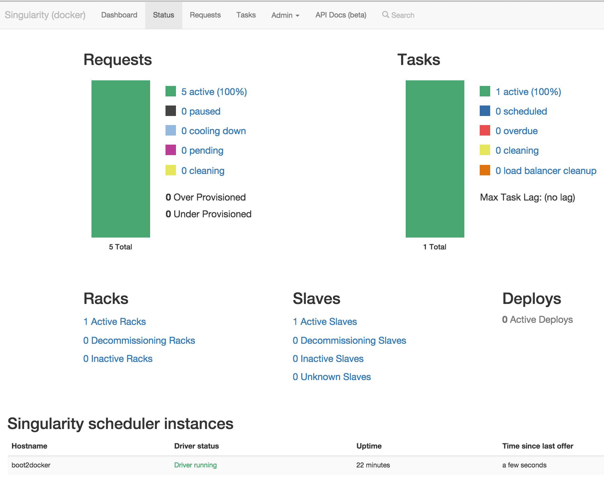
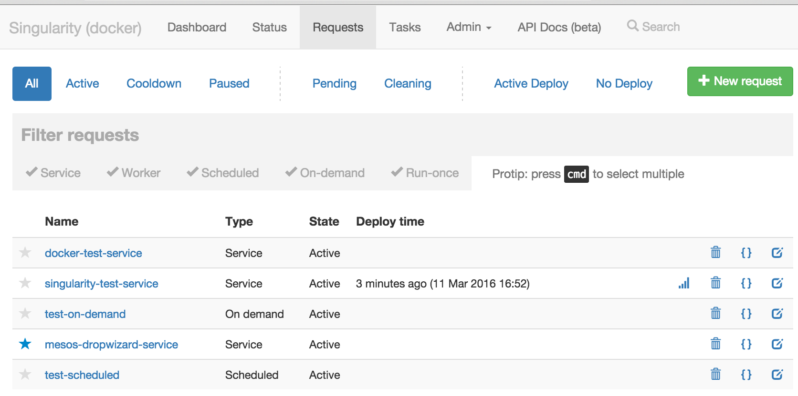
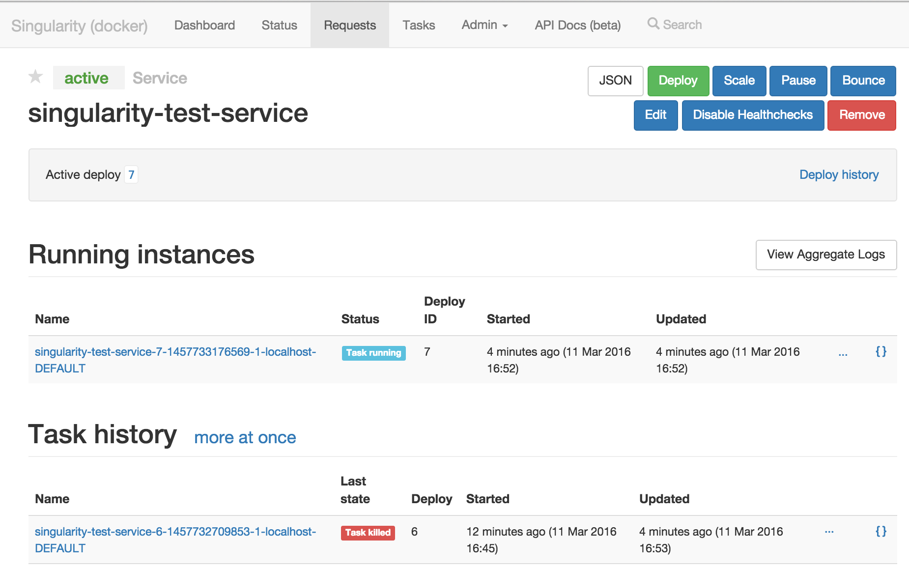
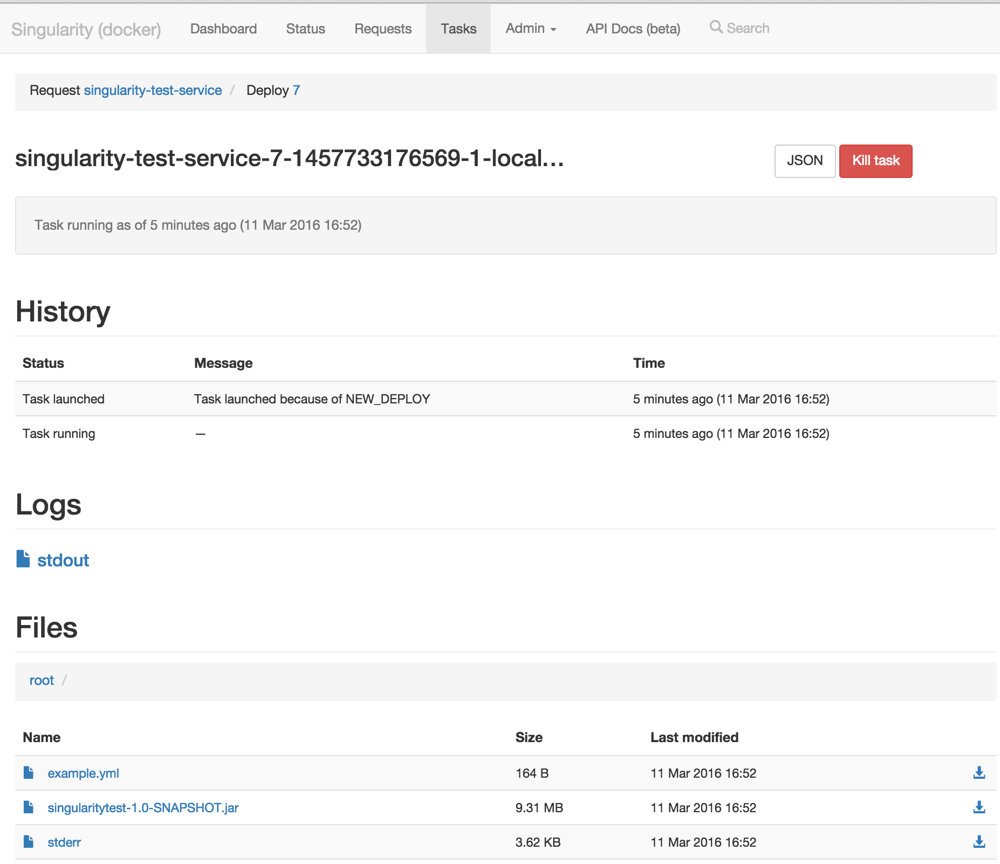
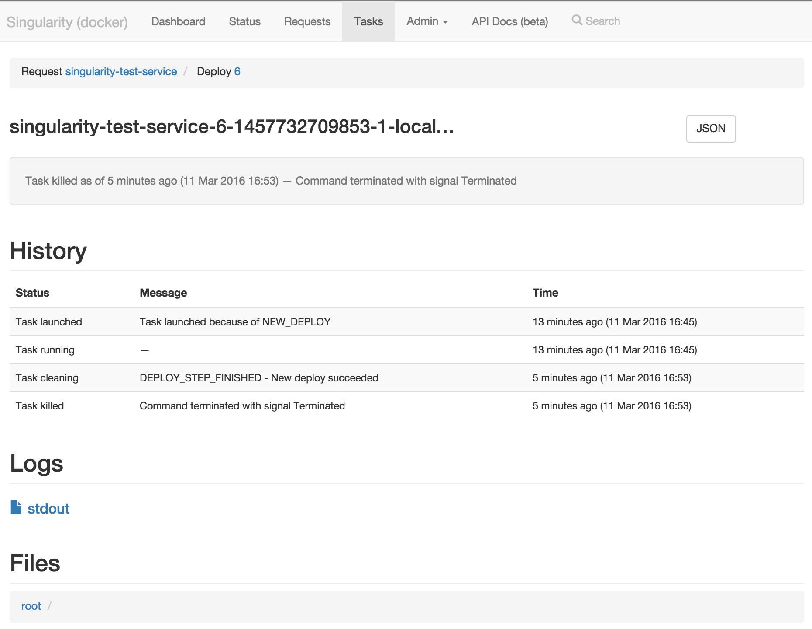
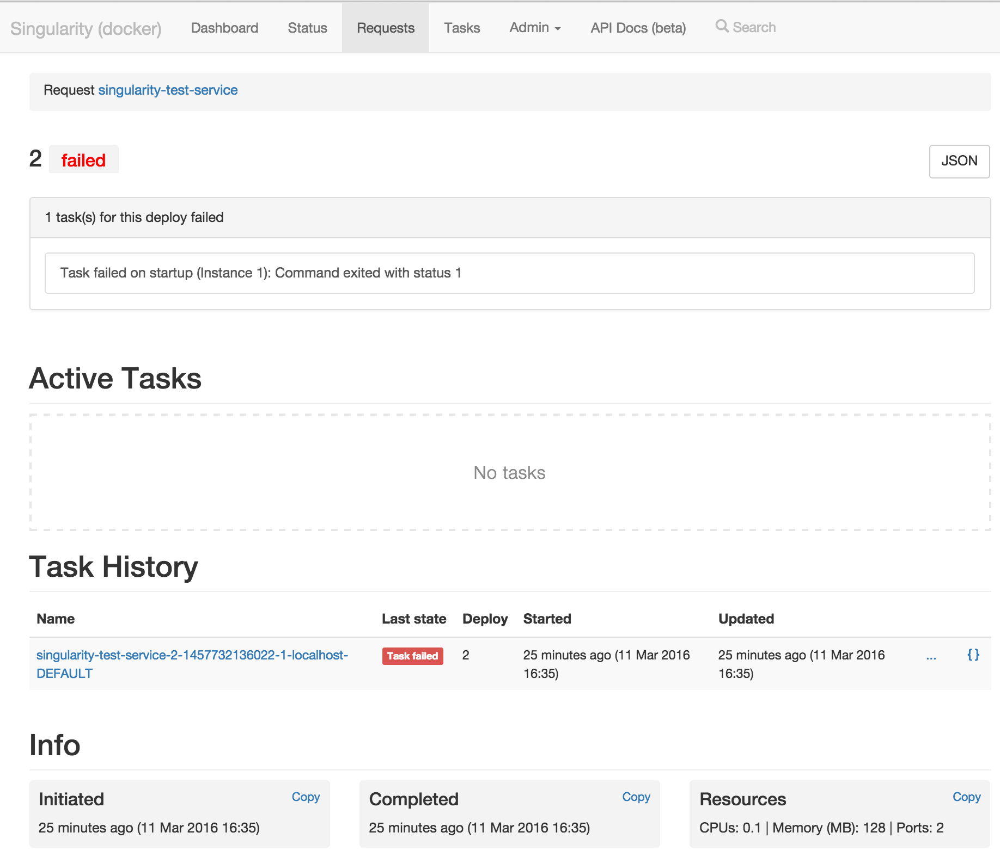
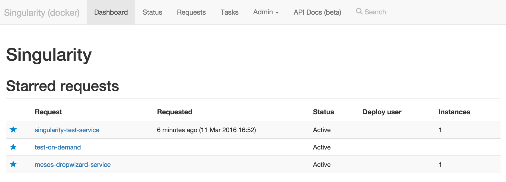
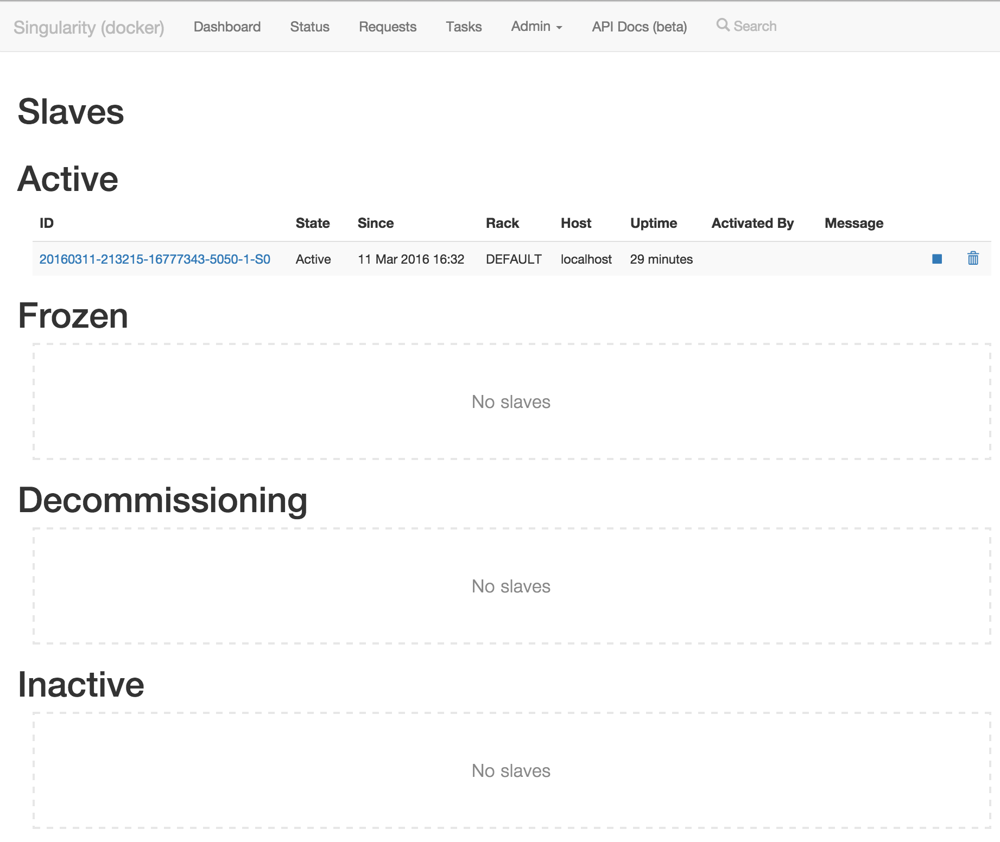
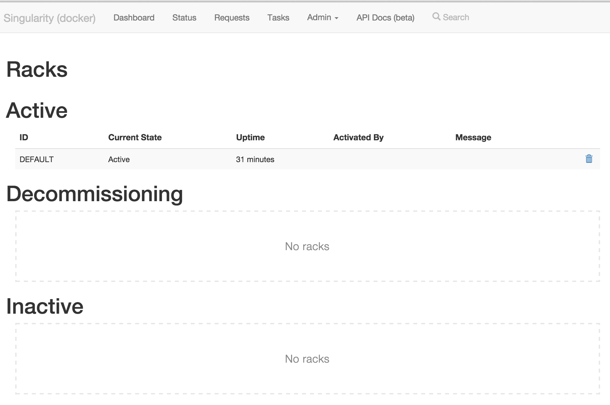
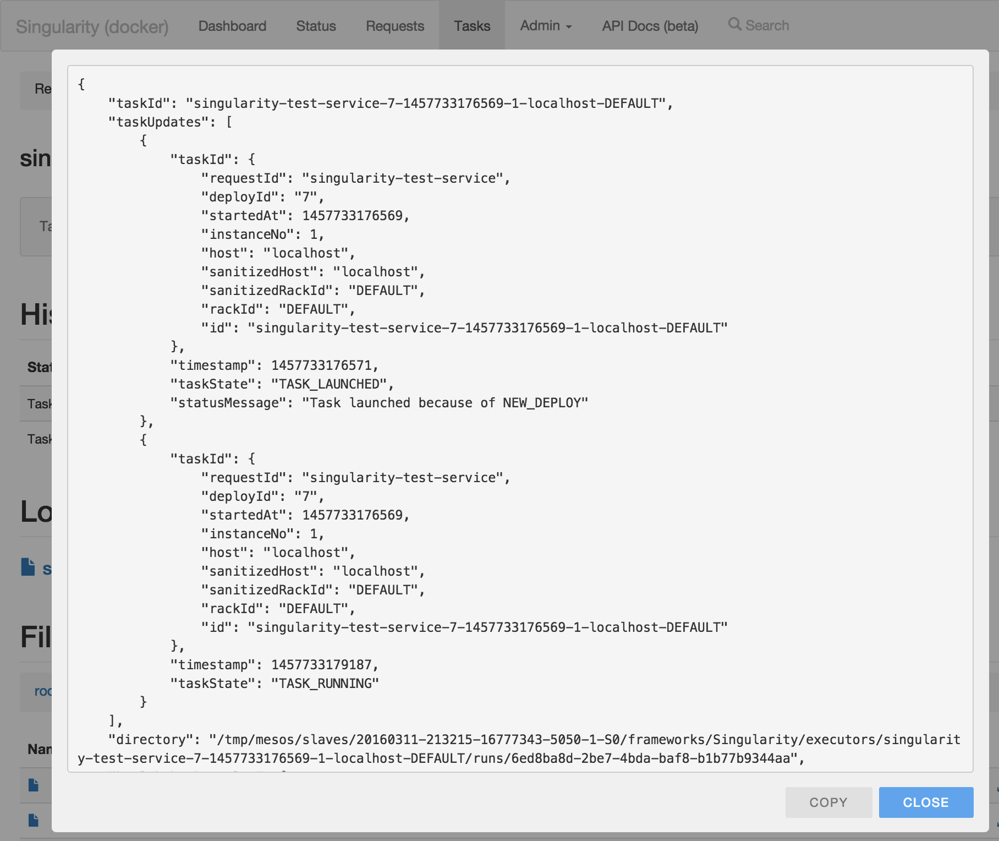

### Singularity UI
The *Singularity UI* is a single page web app that uses the Singularity API to present information about deployed items. 

It allows searching and display of information about active, paused, cooled down, cleaning, and pending items.

Selecting a specific deployed item will display information about its active running tasks, all historical tasks from past deploys, a list of all executed deploys and a list of all updates to item settings (owners, instances, etc.) 

Selecting an active task will display information about the task and provide access to application files and task logs.

Historical information about past task executions are also available and the Singularity UI allows users to directly retrieve the archived log files.

Clicking on a deploy id will show all tasks associated with that deploy and any failure information if the deploy has failed.

A dashboard with the user's deployed and favored items is available.

The Singularity UI contains functionality for performing certain actions on registered deployable items and their tasks:

- **Remove a deployed item**. All running tasks (e.g. the service instances if it is a web service) are terminated and the item is unregistered from Singularity. Historical logs are not removed and will be connected with the item if it is re-registered to Singularity at a later stage.
- **Pause a deployed item**. All running tasks are stopped but the item is not removed. Deploys of paused items are not possible. Users can un-pause the item to restart its tasks and be able to deploy.
- **Manually run** a *Scheduled Job* or *On-Demand* item
- **Kill a running task**. Tasks corresponding to instances of *web service* or *worker* items will be re-started instantly (if possible) - likely in another slave. Scheduled tasks will behave as if the task failed and may be rescheduled to run in the future depending on whether or not the job item has *numRetriesOnFailure* set.
- **Decommission a slave** which means that all tasks running in the specific slave will be migrated to other slaves.
- **Decommission a *logical rack***, meaning that all slave hosts in the rack will be decommissioned. The *rackid* attribute can be used when running the Mesos slave process to specify which rack the slave belongs to. For example when running in AWS a rack could corresponds to the availability zone ( /usr/local/sbin/Mesos-slave --attributes=rackid:us-east-1e).

For all displayed information, access is provided to the API payloads from which views are created. This can greatly help debugging of deploys and can be used by developers that create tools on top of Singularity API.

