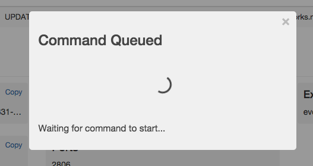

### Shell Commands

As of release `0.4.6`, when using the SingularityExecutor you have the ability to run pre-configured shell commands from the ui, eliminating the need to ssh to the mesos-slave.

The following example shows how to configure SingularityService and the SingularityExecutor for the simple command `lsof`.


#### Configuration

First, add a configuration section to SingularityService's config, this will allow the shell command to appear as an option in the UI. The section will be nested under the `ui` item and look like:

```yaml
ui:
  shellCommands:
    - name: lsof
      description: List open files, including all sockets.
```

`shellCommands` is a list of objects with fields of `name` and `description. Now, in the ui there will be a Shell Commands section available for running tasks like the following:


Next, configure the SingularityExecutor to properly run the command. Add a `shellCommands` section under the `executor` section of the config similar to the following:

```yaml
executor:
  shellCommands:
    - name: lsof
     command: ["/usr/sbin/lsof", "-P", "-p", "{PID}"]
```

A few important notes about the `shellCommands` objects:
 - `name` must match the name of the command from the ui config
 - `command` is an array of strings that form the shell command. Each argument should be a separate array item
 - `{PID}` and `{USER}` are special items and will be replaced with the current process pid or the current user before the command is executed. Placeholder values can be changed by specifying `shellCommandPidPlaceholder` or `shellCommandUserPlaceholder` under the `executor` section of the config.
 - If the process you are operating on is not the parent pid (e.g. using a wrapper script), you can instead pull the process pid from a file. The file to pull from is specified by `shellCommandPidFile` under the `executor` section of the config and defaults to `.task-pid` (found in the root of the sandbox)
 - You can optionally prefix all commands specified with an array of command strings specified in `shellCommandPrefix`. This is useful for things like being sure to execute a switch user command for each command to execute.

 #### Running a Shell Command

 Now that it is configured, navigate to a running task in the Singularity UI. Near the bottom there is a Shell Commands section that can be expanded. In that section, select the shell command you want from the dropdown and hit `Run`. An option of *Redirect to command output upon success* is specified by default, which will wait for the command to return and redirect you to view the output file.

You should see a message similar to the following indicating that the command has been sent to the executor to be run.



Once that completes, you will be redirected to the output of your command (saved as a file in the task sandbox). Back on the task detail page you will also be able to view a history of shell commands run for that process:


